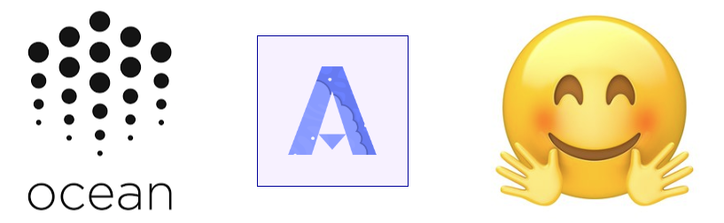

# Algovera: Using the Ocean Marketplace with HuggingFace Apps, Algorithms and Datasets
HuggingFace is an online community of data scientists with a mission of making it as easy as possible to to train, optimize, and deploy models. HuggingFace Hub aims to provide a central place for collecting models, datasets and metrics. The model hub offers thousands of pretrained models to perform tasks on different modalities such as text, vision, and audio. HuggingFace Spaces provides a simple way for data scientists and organisations to demonstrate machine learning apps. It provides access to cloud compute and accelerated deployment. Ocean Protocol is an infrastructure for building data (and algorithm) marketplaces, with the aim of giving ownership of data back to data providers while also unlocking the value of siloed data. Ocean provides libraries for private training and testing of algorithms, such as a technique called compute-to-data (C2D). With C2D, the algorithm travels over the network to the location of the data, runs on the dataset and the results (or the trained weights) are returned to the data scientist. Privacy-enhancing technologies like this have the potential to open up new applications, such as models for sensitive data (e.g. healthcare). Furthermore, the blockchain is used to track provenance of data, training procedures and IP to increase auditability and accountability. For more, read our recent blog [post](https://medium.com/@richardblythman/using-the-ocean-marketplace-with-huggingface-apps-algorithms-and-datasets-28a6602baac5) or check out some of our proof-of-concept demos:

- Algovera Web3 Wallet [App](https://huggingface.co/spaces/AlgoveraAI/algorithm-web3-wallet) on HuggingFace Spaces
- Algovera Token-Gated DCGAN demo [App](https://huggingface.co/spaces/AlgoveraAI/dcgan-crypto-punks) on HuggingFace Spaces
- Algovera Token-Gated CryptoPunks [Dataset](https://huggingface.co/datasets/AlgoveraAI/CryptoPunks) on HuggingFace Hub
- Algovera DCGAN [Model](https://huggingface.co/AlgoveraAI/dcgan) on HuggingFace Hub

# Contents

- [👪 Community](#-community)
- [🤖 AI and Web3](#-ai-and-web3)
- [🏗 Resources](#-resources)
- [🏛 License](#-license)

# 👪 Community

## Algovera

Algovera is a community of individuals working to facilitate and accelerate the development of decentralised AI products and research.

[Website](https://www.algovera.ai/) | [Notion](https://algovera.notion.site/) | [Discord](https://discord.gg/e65RuHSDS5) | [Calendar](https://calendar.google.com/calendar/embed?src=c_4qajdfj4imie9cpnkbvkrc7ri4%40group.calendar.google.com) | [Twitter](https://twitter.com/AlgoveraAI) | [YouTube](https://www.youtube.com/channel/UC2A5iUpP6k52ZZmC8LFj1IA) | [HuggingFace](https://huggingface.co/AlgoveraAI)

## Grants 

We just launched Algovera Grants with $5000 on offer for projects that combine AI and Web3. For more information, read our blog [post](https://medium.com/@richardblythman/introducing-algovera-ai-x-web3-grants-ccc63c986878).

# 🤖 AI and Web3

Why do datasets (and algorithms) need tokens? Tokenizing assets can offer a few benefits. Firstly, they act as access tokens that can only be used by one individual or for a period of time. These tokens could be given away for free, or used to earn income independently. Data scientists will be familiar with needing to register for access to datasets. After making a request to the owners (sometimes with information on the intended use case), the data scientist might receive a link or a login. The issue is that this link or login can be shared with multiple people, and it’s difficult to give fine-grained permissions. Tokens give you better control and governance over assets that you own. This is one of the fundamental principles that Web3 espouses. Tokens are held in a Web3 wallet. Web3 wallets are your ticket to ownership of what you create online as a data scientist. You could publish your creations (such as datasets, algorithms and apps) on multiple platforms, while not losing control of the intellectual property (IP). 

# 🏗 Resources

Here are further resources:

- What are the benefits of [decentralized AI](https://a16z.com/2020/07/24/long-tail-problem-in-a-i/)?
- How do data science workers [collaborate](https://arxiv.org/abs/2001.06684)?

# 🏛 License

The license is MIT. [Details](LICENSE)